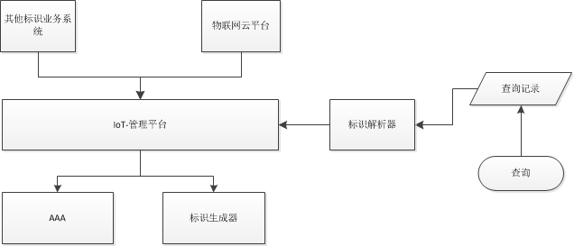

# IoT 系统规划

系统总体架构：

## 基础服务系统

### 统一身份认证系统（AAA）

#### 身份认证流程：

> - 用户使用在统一认证服务注册的用户名和密码(也可能是其他的授权信息，比如数字签名等)登陆统一认证服务;
> - 统一认证服务创建了一个会话，同时将与该会话关联的访问认证令牌返回给用户;
> - 用户使用这个访问认证令牌访问某个支持统一身份认证服务的应用系统;
> - 该应用系统将访问认证令牌传入统一身份认证服务，认证访问认证令牌的有效性;
> - 统一身份认证服务确认认证令牌的有效性;
>   - 应用系统接收访问，并返回访问结果，如果需要提高访问效率的话，应用系统可选择返回其自身的认证令牌已使得用户之后可以使用这个私有令牌持续访问。

#### 功能

- 用户管理
- 用户认证，支持OAuth2.0
- 第三方应用管理
- 单点登录
- 权限管理
- 会话管理

### 数据存储服务

#### 数据分类

- 一维数据 ： 时间轴上，非连续数据
- 二维数据： 时间轴上，连续数据
- 多媒体数据： 时间轴上，连续多维度数据

#### 数据存储类型

- sql 
- nosql
- fs (nfs)

### 数据存储介质

- 传统的存储介质（磁盘、磁带）
- 云存储服务

## IoT 管理平台

提供标识管理服务：企业登录、标识管理、标识绑定（id<-> 商品）

### 标识生成器

根据规范生成标识。

| 版本Version    | 时间戳Time   | 地址Position      | 类别Type                   | 厂家Brand    | 编号ID       |
| ------------ | --------- | --------------- | ------------------------ | ---------- | ---------- |
| 2位数字/4位字母+数字 | 8位日期+6位时间 | 4位国家码+4位区号+6位邮编 | 1/3位字母+**4-10**位数字+**Z** | 4/6位字母数字混编 | 6/8位字母数字混编 |

### 标识解析器

解析标识，查找标识对应商品信息。并按照一定格式返回给用户。

### 企业管理

- 公司注册
- 公司信息修改

### 标识管理

- 标识申请
- 标识查询
- 标识信息修改
- 标识回收
- 标识绑定（标识-商品）

###  商品管理

- 商品登记
- 商品信息修改

### 分析统计服务

- 公司注册统计 （时间、类别、地址）
- 公司注册标识统计 （厂家、类别、时间）
- 标识注册统计 （时间、地址、类别、厂家）
- 标识活跃统计 （查询时空域分析）

### 标签管理

- 标签管理

  - 生成
  - 变更

- 提供mqtt接口实现，支持订阅和推送

- 标签样式：细节要求

  

## 物联网云平台

### 平台定位

- 提供服务，使物联网设备可以轻松安全的云应用程序以及其他设备交互
- 平台支持数亿台设备和数万亿条消息，并对这些消息进行处理，并将其可靠的路由至物联网终端节点和其他设备。应用程序可以随时跟踪所有设备并与其通信。

##  项目计划&安排

### IoT管理平台

| 模块                  | 预估工作量（工作日） | 投入人员        |
| ------------------- | ---------- | ----------- |
| 项目整体方案设计（架构、数据库、流程） | 20         | 架构师、PM      |
| 标识生成器&标识解析器         | 5          | 后台工程师       |
| 企业管理                | 8          | 后台工程师+前端工程师 |
| 标识管理                | 8          | 后台工程师+前端工程师 |
| 商品管理                | 5          | 后台工程师+前端工程师 |
| 分析统计服务              | 10         | 后台工程师+前端工程师 |
| 标签管理                | 10         | 后台工程师       |
| 系统测试                | 10         | 测试工程师       |

> 预计投入： 1架构师、2后台工程师、1web工程师、2测试工程师
>
> 开发周期： 预计50个工作日

### 统一身份系统 

- 暂未启动

### 数据存储服务

- 暂未启动

### 物联网云平台

- 下一阶段工作，暂未启动