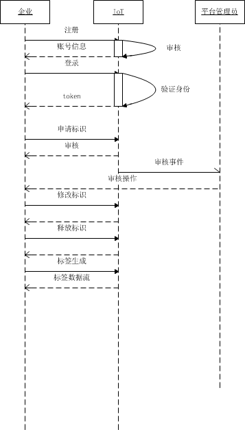
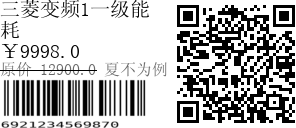
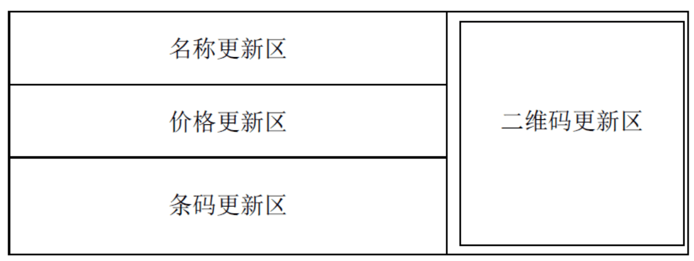

# IoT 标识服务

## 1. 引言

### 1.1 概述

IoT标识系统主要用于标识的分配和管理。

### 1.2 专业术语

- 地区编码（geocode） ： 地区编码，参考`行政区域代码表-仅国内，国家统计局2015-09-30发布，详情请查看`[行政区划代码](http://www.stats.gov.cn/tjsj/tjbz/xzqhdm/201608/t20160809_1386477.html)
- 商品类别（category）： 商品分类参考，具体参考`产品目录表，参考广州市《政府采购品目表》`
- 标签（tag）：简写tag 
- 标识（id）： 
- 一维码： 
- 二维码

## 2. IoT标识服务概述

### 2.1 服务简介 

IoT标识服务主要提供标识的生成与分配和管理。标识服务不涉及商品的详细信息，商品的管理与业务逻辑管理由其他系统提供。


### 2.2 服务系统业务流程 



## 3. 功能需求

### 3.1 企业管理

- 企业注册： 提交企业信息，注册企业账号（企业名称，统一社会信用代码，注册地，法人，联系电话）
- 企业审核： 企业身份审核，企业提交信息后，IoT平台管理员审核提交信息。企业注册未通过是，平台功能关闭
- 企业信息修改： 统一社会信用代码不能变更，其他都可以更改。
- 企业账号修改： 
  - 修改密码
  - 找回密码
- 企业注销： 注销企业账号，系统暂时保留企业记录与相关信息，账号不能登陆。需要联系人工客服处理。

### 3.2 标识管理

- 标识申请： 企业提交标识申请，设置商品品类，以及申请的标识数量。`限制企业一次最多能申请的标识数量，目前限制在100w条`
- 标识申请审核： IoT平台管理员审核标识申请
- 标识生成： 企业标识申请通过后，系统生成足量的标识记录
- 标识修改： 修改标识信息（只能修改时间、地点字段），支持批量修改。
- 标识状态更新： 目前只有未使用、使用两种状态
- 标识回收：标识重新进入未使用状态

### 3.3 标签

- 标签生成： 

  传递商品信息，生成标签图片。提供http&mqtt协议实现。

  - demo场景： 

    ```md
    request： 
    	version: 01
    	geocode: 110111  (用户选择省市区)
    	category: A010203 （用户选择商品类型，支持模糊查询）
    	name : 商品名称，限制16个字符
        price: 商品价格，浮点型，检测类型
        ori_price: 商品原价, 浮点型，检测类型， 可选。
        promotion: 促销活动名称， 可选，最长4个字符。promotion与ori_price同时设置才会生效。
        barcode: 商品一维条码，13位整数，检测类型

    response
    content-type ： image/png
    body : png stream
    ```

  - 业务场景：`未确定`

- 标签刷新：

  刷新标签部分区域。