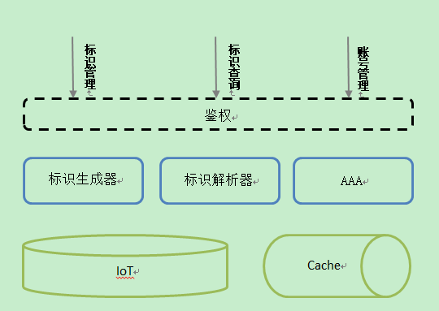

# 标识平台技术方案

| version | author | date       |
| ------- | ------ | ---------- |
| 0.1.0   | hayate | 2017-06-22 |
| 0.1.1   | hayate | 2017-07-08 |


## 术语规范

- 标识： 物品的唯一id，由大写字符和数字组成。标识包含：标识版本，标识生成时间，地址，类别，品牌，序列号信息

## 功能需求


## 技术指标

- 支持并发 2000QPS
- 90%的请求要求在1s内返回（批量处理除外）
- 数据库支持主从和读写分离，加速数据查询和写入效率
- 业务支撑分布式部署和负载均衡，具有一定的容灾能力

## 设计方案

### 技术选型

- [python3.5](https://www.python.org/)以上  :  代码简洁,开发效率高,较以往版本执行速度有提升,未来升级拓展方便 
- [tornado](http://www.tornadoweb.org/en/stable/) :  v4.5 以上,支持协程. 异步非阻塞框架
- [mariadb](https://mariadb.com/) : v10.1,类mysql数据库,支持集群,动态列.
- [pymysql](https://github.com/PyMySQL/PyMySQL) : 数据库driver, 支持python3.5
- [redis](https://redis.io/) : v3.2.9 , 用户数据库缓存服务
- [yaml](http://www.yaml.org/): 存储系统配置以及一些其他格式化文件
  - 服务配置
- json: 以静态资源返回资源类型
  - 行政区域编码
  - 政府采购类目编码
- [pip](https://pypi.python.org/pypi/pip): python 包管理工具
- requirements: 记录pip管理包的版本

```text
tornado 	# web 框架库 version>=4.5 https://github.com/tornadoweb/tornado/
Pillow 		# 图片处理库 version>4.0 https://github.com/python-pillow/Pillow
qrcode 		# 二维码生成库 version >= 5.3 https://github.com/lincolnloop/python-qrcode
barcode 	# barcode生成库， version >= 0.6.0 https://pypi.python.org/pypi/barcode/0.6.0
cryptography# 密码学库， version>=1.9 https://github.com/pyca/cryptography
pyaml		# yaml库， version>=16.12.2 https://github.com/mk-fg/pretty-yaml
pymysql		# mysql 链接库，version>=0.7.11 https://github.com/PyMySQL/PyMySQL
```

### 代码结构

- web

```text
# 约定
# 目录后跟随‘/’
# __init__.py  默认不提示

iot_serve.py 			## 服务入口

conf/					## 服务配置相关module，一般load对应conf.d 目录中的配置文件
	settings.py 		# 服务配置
	geocode.py 			# 地址区域配置
	category.py 		# 商品类别配置
	
conf.d/					## 服务配置
	fernet/				# fernet 密钥目录， 密钥名称0、1、2 ， 0为主密钥
		0
		1
	font/				# 字库目录
		simsun.ttc		# truetype 宋体
	category.json		# 商品类别
	geocode.json		# 区域编码
	serve.yml			# 服务配置

docs/ 					## 系统文档目录

common/					## 通用工具库
	error.py 			# 系统自定义异常
	util.py				# 常用工具函数
	fernet_utils.py		# fernet key 管理库
	fernet_formatters.py# fernet 加解密
	converter.py 		# 整数转换，实现int-36进制的转换

worker/					## 业务逻辑库
	tag.py				# 标签生成库
	
handler/				## web handler 逻辑
	base.py				# base handler class
	tag.py				# 标签生成handler
	token.py			# token handler
	
```


- www

```text
# 约定
# 目录后跟随‘/’

static/					## 静态资源目录
	conf/				# 前端是用到的配置文件
    	category.json	# 后台生成的category.json要存放于此
    	geocode.json	#
    	
```


- other

### 系统方案

> 协议： 服务使用http[s] 协议，上线后可以根据需求灵活配置
>
> `传输协议： [protobuf](https://github.com/google/protobuf) ，字节流，传输数据量小，方便各终端语言接入 `
>
> 身份： 使用token 而不是session机制
>
> API ： 采用restful规范，用户自描述状态，方便服务端水平扩展
>
> web页面： 与后端完全分离，采用vue框架

系统整体设计图：

#### 标识生成器

根据版本、企业、类型等信息，输出一个或一系列标识。为保证商品编号id唯一，对于每种[版本、企业、类型]字段，维护一个自增索引。

编号采用10+26进制整形表示。

```python
# 转换函数，输出_len长度的字符串，不足使用0补全， 如若超出则raise 异常

def str_to_decimal(_in, _n):
    '''
    转换字符串->10进制整数
    	_in : 待转换的字符串
    	_n  : 字符串按照_n进制转换
    ''''
    pass

def decimal_to_str(_in, _n, _len):
    '''
    转换10进制整数->字符串
    	_in : 10进制整数
    	_n : 字符串按照_n进制转换
    '''
    
def generate_id(time, addr, type, brand, ver):
    pass
```

- 当前方案： 标识生成器集成在web application中
- 未来升级： 可采用RPC调用，把标识生产作业放到其他app中，通过MQ进行作业调度

#### 标识解析器

标识解析使用re（正则表达式进行匹配）。

```python
import re
import string

# short_pattern = r'\d{2}\d{8}\d{10}[A-Z]\d{4,10}Z[A-Z0-9]{4}[A-Z0-9]{6}'
# long_pattern = r'[A-Z]{2}\d{2}\d{14}\d{14}[A-Z]{3}\d{4,10}Z[A-Z0-9]{6}[A-Z0-9]{8}'
KEYWORDS = {'version', 'time', 'postion', 'category', 'tail', 'brand', 'serial'}
short_id_specification = [
    ('version', r'\d{2}'), 			# version
    ('time', r'\d{8}'), 			# date : %Y%m%d
    ('postion', r'\d{10}'), 		# postion 
    ('category', r'[A-Z]\d{4,10}'), # category
    ('tail', r'Z'), 				# category tial char 'Z'
    ('brand', r'[A-Z0-9]{4}'), 		# brand
    ('serial', r'[A-Z0-9]{6}')		# serial number
]
long_id_specification = [
    ('version', r'[A-Z]{2}\d{2}'), 			# version
    ('time', r'\d{14}'), 		 			# date : %Y%m%d
    ('postion', r'\d{14}'), 		 		# postion 
    ('category', r'[A-Z]{3}\d{4,10}'),	 	# category
    ('tail', r'Z'), 				 		# category tial char 'Z'
    ('brand', r'[A-Z0-9]{6}'), 				# brand
    ('serial', r'[A-Z0-9]{8}')				# serial number
]

# 预编译，加速后续匹配速度
short_id_regex = re.compile(''.join('(?P<{}>{})'.format(pair[0], pair[1]) for pair in short_id_specification))
long_id_regex = re.compile(''.join('(?P<{}>{})'.format(pair[0], pair[1]) for pair in long_id_specification))

def parser(_id):
    regex = short_id_regex if _id[0] in '0123456789' else long_id_regex
    m = regex.match(_id)
    if m:
        # {'brand': 'DELL', 'version': '01', 'postion': '0020511400', 'category': 'A02010104', 
        # 'time': '20170511', 'serial': 'CN0001', 'tail':'Z'}
        return m.groupdict()
    raise ValueError('id: {} is abnormal'.format(_id))

if __name__ == '__main__':
    short_id = '01201705110020511400A02010104ZDELLCN0001'
	long_id = 'AA012017051117473000860731410006XXA02010201ZHUAWEINET00018'
    print(match(short_id))
    print(match(long_id))
```

### aaa (身份、验证、授权)

> - 系统使用token来进行身份验证和权限管理,token携带权限和有效期字段，默认有效期60分钟

token加密算法使用 fernet，fernet密钥，30分钟滚动一次（对应token有效期60分钟），队列缓存3个fernet密钥组。多服务进程时，注意fernet key的同步问题。

参与计算的密钥字段以形式{}， 除包含用户的帐号信息外，还包含终端信息：ip。验证终端时，服务会检查ip地址。


### 短域名服务

> - 使用第三方短域名服务？
> - 自身提供短域名服务？

## 附录

